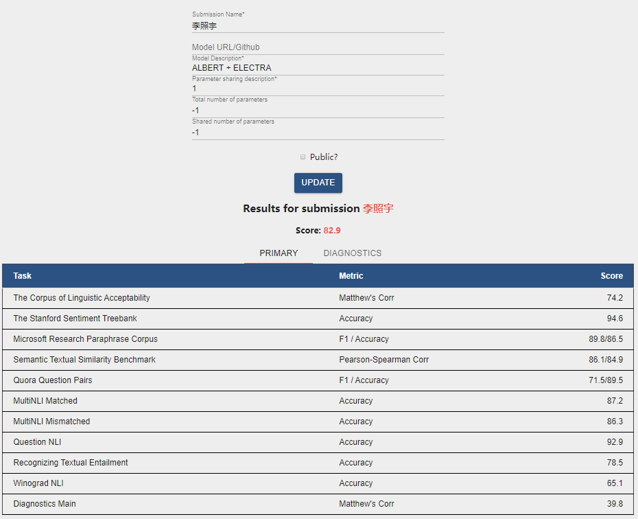

# CS229_Project
This is a course project for Nature Language Process(CS229), ACM Class 2017, SJTU. Written in 2020.

## Introduction
The General Language Understanding Evaluation (GLUE) benchmark is a diverse set of existing natural language understanding tasks. In this course project, we choose **CoLA** as our task to evaluate the performance of our language models. For my approaches, at first, I try **ERNIE**, **MT-DNN**, **RoBERTa** models with carefully parameters selecting. However, I fail to achieve good scores on dev set. After reading the latest papers and codebases, I finally choose two models: **ALBERT**(from Google Research and the Toyota Technological Institute at Chicago) and **ELECTRA**(from Google Research/Stanford University) as my pretrained models and then finetune on CoLA tasks respectively. I use ensemble method to combine the results derived from the two models and obtain a quite good score **74.2** on CoLA task.

For details of my method and evaluation, please refer to my [report](doc/report.pdf).
I also provide some [checkpoints](https://jbox.sjtu.edu.cn/l/hJjlw9) of my model, you can download them if you like. 

## Prerequisites
* Python 3
* NumPy
* scikit-learn
* SciPy
* comet_ml

The code is compatible with PyTorch 1.5.0 and TensorFlow 1.15. In addition, you need to execute the followings in order to download CoLA dataset and install other packages.

```bash
# Install apex
git clone https://github.com/NVIDIA/apex
cd apex
pip install -v --no-cache-dir --global-option="--cpp_ext" --global-option="--cuda_ext" ./

# For ALBERT
cd albert
# Download CoLA data
wget https://gist.githubusercontent.com/W4ngatang/60c2bdb54d156a41194446737ce03e2e/raw/17b8dd0d724281ed7c3b2aeeda662b92809aadd5/download_glue_data.py
python download_glue_data.py --data_dir glue_data --tasks CoLA

pip install --editable .
mkdir logs

# For ELECTRA
cd ../electra
# Download CoLA data
wget https://gist.githubusercontent.com/W4ngatang/60c2bdb54d156a41194446737ce03e2e/raw/17b8dd0d724281ed7c3b2aeeda662b92809aadd5/download_glue_data.py
python download_glue_data.py --data_dir glue_data --tasks CoLA

cd glue_data
mkdir finetuning_data
mv CoLA finetuning_data/cola

# Download model
mkdir models
cd models
wget https://storage.googleapis.com/electra-data/electra_large.zip
unzip electra_large.zip

```

## Finetune on CoLA task
I provide two scripts for ALBERT and ELECTRA to finetune on CoLA task. For ALBERT, I release the hyper parameters I used to reproduce the result. For ELECTRA, just run the script and it will use different random seeds and all of them have good and stable performance.
```bash
# For albert
cd albert
bash run_cola.sh

# For electra
cd electra
bash run_cola.sh

```
## Inference on CoLA task
I provide two python files for inferencing on CoLA task. Just modify the path to your model or checkpoint in inference.py for prediction.
```bash
# For albert
# The average score of the three models on CoLA test set are more than 69.8.
cd albert
python inference.py

# For electra
# Almost all of the models achieve more than 70.1 score on CoLA test set.
cd electra
python inference.py

```
## Reference
* https://github.com/zhuchen03/FreeLB
* https://github.com/google-research/electra
* https://github.com/huggingface/transformers

## Appendix
The screenshot of my test result is showed as below:



